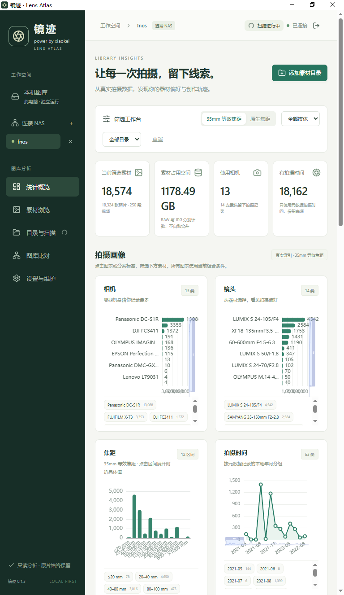
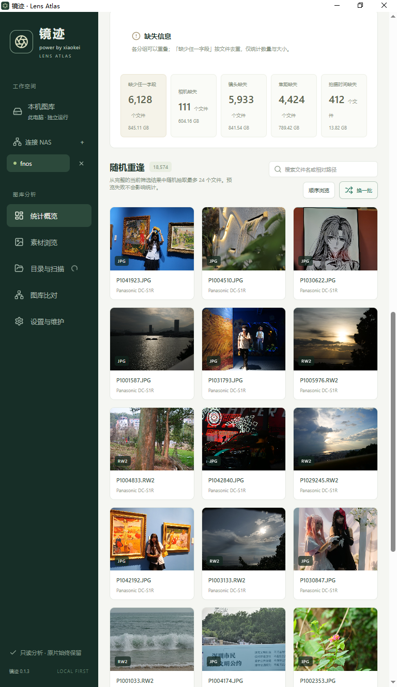
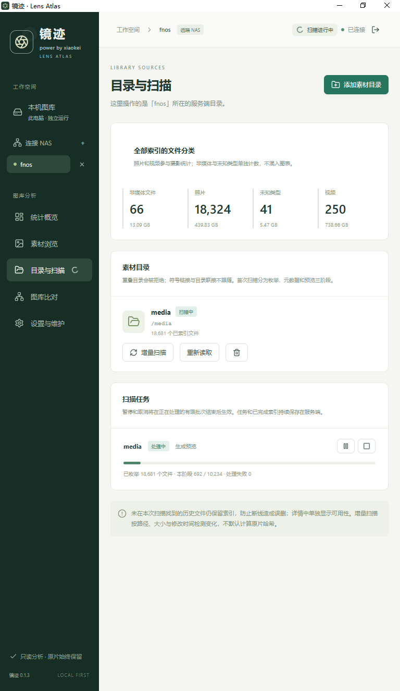
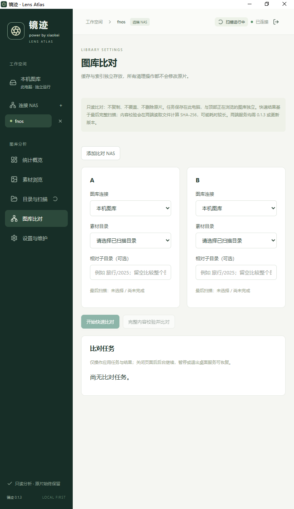
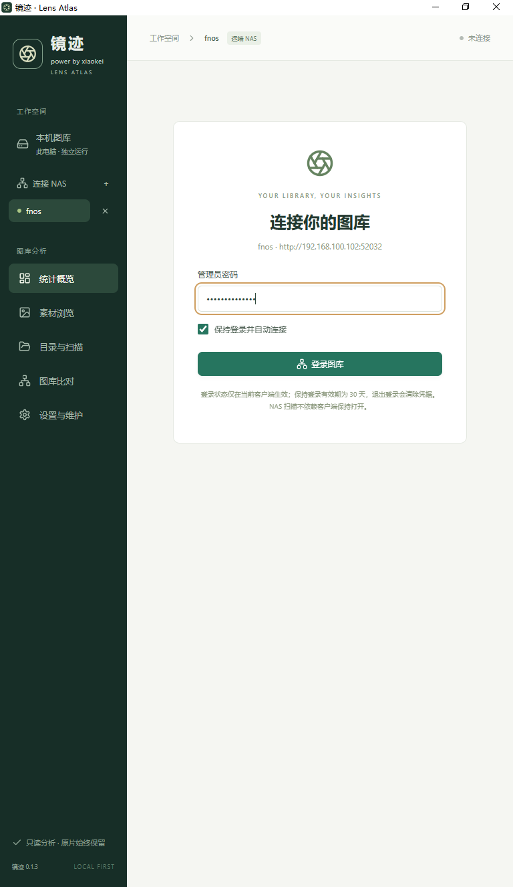
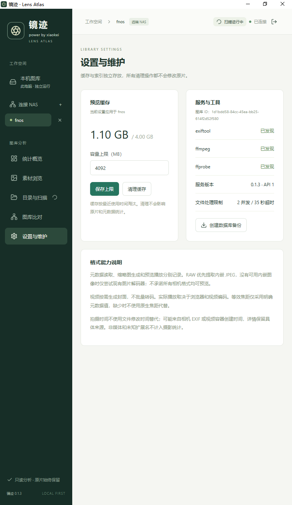
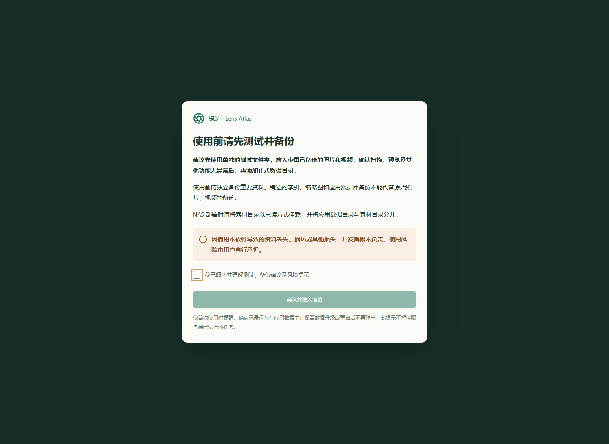

# 详细使用与开发说明

以下保留镜迹 0.1.8 及手机访问预览版的详细说明。当前下载与版本状态以仓库首页 README 为准。

# 镜迹 · Lens Atlas

> **使用前必读：先测试，再添加正式数据。**
>
> 建议先使用单独的测试文件夹，放入少量已备份的照片和视频；确认扫描、预览及其他功能无异常后，再添加正式数据目录。使用前请独立备份重要资料，索引、缩略图和应用数据库备份不能代替原始照片、视频的备份。NAS 部署请将素材目录只读挂载，并与应用数据目录分开。
>
> **因使用本软件导致的资料丢失、损坏或其他损失，开发者概不负责，使用风险由用户自行承担。**
>
> Windows 安装版、免安装版与 Docker 部署仅在首次使用时显示风险提示，勾选确认后记录保存在各自的应用数据中。刷新、重新打开、退出登录、重启或保留数据升级后不再弹出；清空应用数据或使用新的数据目录后需重新确认。NAS 先登录管理员再确认，同一部署无需每个浏览器重复确认。旧版未保存确认记录，升级后需确认一次。此提示不暂停服务端已经运行的任务；添加素材目录时保留行内测试与备份建议。

当前版本 **0.1.8**。新增所有图表联动筛选与再次点击取消，优化 NAS 统计查询与客户端远程连接复用；保留扫描异常隔离、首次使用确认、只读图库比对和 Windows 保持登录。更新记录见 CHANGELOG.md。NAS 默认端口为 52032。Docker 镜像内置运行依赖，安装步骤见 DOCKER_RELEASES.md，实际验证见 VALIDATION.md。

公开源码仓库：[xiaokeikei/Lens-Atlas](https://github.com/xiaokeikei/Lens-Atlas)。安装包见 [v0.1.8 Release](https://github.com/xiaokeikei/Lens-Atlas/releases/tag/v0.1.8)，包含 Windows 安装版、免安装版、Docker 在线与离线包及 SHA-256 校验值。旧版本不会自动更新，请下载新版并保留原应用数据目录。

只读分析照片与视频：本机独立图库、Windows 客户端连接 NAS、NAS Docker 服务共用 React 界面和 FastAPI / SQLite 后台。

这是真实实现，不是静态演示。界面默认为空，统计和照片墙全部来自你选择的目录。
项目内 `.runtime/合成 测试图库` 是开发验收夹具，图片带有 SYNTHETIC FIXTURE 标识，**不代表真实相机样例**。

## 下载与界面预览

| 使用方式 | Release 附件 |
| --- | --- |
| Windows 安装版 | `LensAtlas-0.1.8-Setup-x64.exe` |
| Windows 免安装版 | `LensAtlas-0.1.8-windows-x64.zip` |
| NAS 联网构建 | `LensAtlas-0.1.8-docker-online.zip` |
| NAS 离线导入（linux/amd64） | `LensAtlas-0.1.8-docker-offline-amd64.zip` |
| 完整性校验 | `SHA256SUMS.txt` |

以下 6 张截图由项目作者提供，展示 0.1.3 的实际界面；0.1.8 保留这些功能，并包含下方的风险确认提示。截图中的图库数量、设备名称和素材仅为展示，不代表安装后的默认内容。

<table>
<tr><td align="center"><b>图库信息主页</b><br/></td><td align="center"><b>随机图片展示</b><br/></td></tr>
<tr><td align="center"><b>目录与扫描</b><br/></td><td align="center"><b>图库比对</b><br/></td></tr>
<tr><td align="center"><b>远程登录</b><br/></td><td align="center"><b>设置与维护</b><br/></td></tr>
</table>

<details><summary>0.1.8 使用前风险确认提示</summary>



</details>

## Android 手机只读扫描版（开发测试版）

新增独立 Android 客户端源码 `android/`，支持 Android 10 及以上：扫描全部已授权相册或指定相册，在手机本地查看统计、组合筛选与素材预览；也可连接已部署镜迹的 NAS，只读浏览其统计和素材。手机与 NAS 图库独立显示，不上传、不修改、不删除任何原始素材或相册内容。

索引和连接地址只保存于应用私有目录；安卓端不申请媒体写入或全盘文件管理权限。远程客户端采用接口白名单，可控制服务端已有目录的只读扫描任务，不开放目录增删、素材修改、缓存清理、备份或设置修改接口。保持登录使用 Android Keystore 加密保存会话，不保存密码，重新打开恢复上次图库。Android 14 及以上的部分照片授权会明确显示为部分图库。

当前为独立版本号 `0.1.3` 的 APK 开发测试包，尚未发布到公开 Release。新版共用网页/PC 的 React 卡片、ECharts 图表和照片墙，使用手机导航布局。APK 已在 U30 Air Android 13 上安装并完成原生合成扫描/NAS 查询测试；该设备缺少 WebView，仅能验证组件缺失提示，无法验收新版网页界面。界面通过手机尺寸的 Chromium 合成数据测试；普通手机、Android 14 部分授权、真实大图库和 RAW 格式覆盖仍需验证。详见 [Android 说明](android/README.md) 与 VALIDATION.md。

Windows 开发环境可执行 `./scripts/build_android.ps1`，脚本使用英文路径构建目录以避开中文路径的 Java 测试进程问题。输出 `dist/android/LensAtlas-0.1.3-android-debug.apk`。桌面端与 NAS 原有实现保持独立。

## 手机连接电脑图库（本地开发预览版）

电脑预览包 `../release/LensAtlas-mobile-access-preview-windows-x64.zip` 基于公开 0.1.8，新增“手机访问 → 连接本机图库”（Ctrl+M）。入口默认关闭；主动开启后使用单独连接密码，默认端口 52033，支持局域网/VPN。可选择下次启动继续开启。手机读取电脑已有本机图库，查询与扫描共用当前桌面服务和索引，不运行第二个数据库实例，不修改原片。

关闭旧桌面实例后运行完整预览包，默认保留原应用数据。复制界面显示的地址和连接密码到手机，勾选保持登录。电脑端保持运行；Windows 防火墙需允许程序的专用网络访问。修改连接密码会撤销旧手机会话。详细使用说明见 Android README；此预览包没有替代或发布公开 0.1.8 Release。

## Windows 使用

1. 打开 `dist/LensAtlas/LensAtlas.exe`。分发时必须保留整个 `LensAtlas` 文件夹及 `_internal`，不能只复制 exe。
2. 默认进入“本机图库”，点“添加素材目录”。输入本机目录、移动硬盘路径，或当前 Windows 用户有权访问的 `\\服务器\共享\照片`。
3. 添加后自动扫描。目录页显示枚举、元数据、预览三阶段进度，可暂停、取消和恢复。
4. 点击图表分类组合筛选，用“换一批”从完整筛选集合重新抽样；“顺序浏览”按 24 个一页查看。
5. 默认使用 35mm 等效焦距，切换原生焦距会清除旧的数值焦距筛选，避免把原来的数值误套到另一口径。
6. 点素材卡片查看元数据、来源、可用性、预览失败原因。视频可尝试浏览器内播放；桌面版还可以点击“在桌面播放器中打开”，使用内置 Qt Multimedia 解码。播放器默认静音，支持播放/暂停和进度拖动，不自动转码。

应用是独立窗口，随包携带 Python、Qt WebEngine、ExifTool、FFmpeg 和 FFprobe。不需要安装 Python / Node / Docker，不需要 NAS，不使用外部浏览器作为桌面入口。
本机服务只监听 `127.0.0.1` 随机端口，每次启动生成本机会话凭据。界面字体、脚本和图表均随包，无 CDN 运行依赖。
安装目录内不放个人数据库。默认数据目录：`%LOCALAPPDATA%\LensAtlas`。
需要自定义时使用 `LensAtlas.exe --data-dir "D:\My LensAtlas Data"`。

关闭窗口会停止本地服务，把未完成任务保留为可恢复状态；正在处理的文件有超时上限，通常数秒内退出。
同一本机数据目录禁止同时开启两个桌面实例。关闭后再次进入“目录与扫描”点“恢复”。

首期包是免安装目录包，包含应用图标；可自行为 exe 建立桌面快捷方式。未进行代码签名。
实际验证平台和已知限制见 `VALIDATION.md`，不要把本机验证等同于所有 Windows 10/11 设备均已验证。

## Windows 连接 NAS

在左侧选“连接 NAS”，填写名称和 `http://NAS局域网地址:52032`，保存后登录管理员。
可保存多个连接；点击切换图库，标题栏始终显示当前所在服务。连接记录保存在本机 SQLite，**不保存密码**，远端令牌仅在本机服务内存中保存。
客户端重启后远端需要重新登录。支持 HTTPS，并校验证书；自签名证书需正确加入系统/受信任证书链，不提供跳过校验开关。

远端目录选择的是 NAS 服务的授权路径，例如容器 `/media/旅行`，不是 Windows 路径。
电脑无需挂载 SMB。NAS 扫描由独立服务执行，关闭客户端不终止 NAS 扫描。
不复制或同步数据库，不合并本机与多个 NAS 的统计。不同浏览器/设备分别持有自己的筛选条件。

## NAS Docker 部署（linux/amd64 优先）

已在一台用户授权的 Debian 12 x86_64 NAS 上完成实际镜像构建、容器启动、非 root 运行和原片只读挂载检查，并启动真实图库扫描。
本次另抽查了 DNG、RAF、RW2 各一个样本的元数据和预览。完整扫描尚在进行，其他 NAS 与格式/机型仍需分别验证；见 VALIDATION.md 最新记录。

在 NAS 上把源码放进一个应用目录，复制 `.env.example` 为 `.env`，填写真实路径：

```dotenv
LENS_MEDIA_PATH=/your/existing/photos
LENS_APP_PATH=/your/existing/lens-atlas-data
LENS_BIND_IP=0.0.0.0
LENS_PORT=52032
LENS_UID=1000
LENS_GID=1000
```

这些是示例，必须替换；素材路径和应用数据路径必须事先存在。应用目录需要让指定 UID/GID 可写，素材目录及其子目录需要可读和可遍历。镜迹不会以 root 运行或自动修改原片权限；个别无权限子目录会被跳过并在扫描结果中列出，其他文件仍继续扫描。

如果只需为容器用户授予素材只读权限，可在 NAS 宿主机上使用 ACL（把 `1000` 替换为 `LENS_UID`）：

```sh
sudo setfacl -R -m u:1000:rX /your/existing/photos
```

也可以让 `LENS_UID/LENS_GID` 与原片所有者一致。不建议为了扫描而将容器改为 root，也不建议对整个图库开放写权限。
默认绑定 `0.0.0.0`，监听宿主机所有 IPv4 地址；NAS 更换局域网 IP 后无需修改容器配置，使用新地址访问即可。仅需本机访问时可改为 `127.0.0.1`。不要配置路由器端口转发或公开到互联网。

```sh
docker compose config
docker compose build
docker compose up -d
docker compose ps
docker compose logs --tail 100
```

在浏览器或 Windows 客户端访问 `http://NAS局域网地址:52032`。首次初始化需要读取 NAS 应用数据目录 `setup-code.txt`，输入初始化码并创建至少 10 字符的管理员密码。初始化成功后该文件删除。
登录会话 12 小时过期。管理员登录有失败速率限制。HTTP 用于可信局域网；需要加密时使用受信任的 HTTPS 反向代理。

映射关系：

| NAS 宿主机 | 容器内 | 权限 |
| --- | --- | --- |
| `LENS_MEDIA_PATH` | `/media` | 只读，原片 |
| `LENS_APP_PATH` | `/data` | 读写，索引/配置/缓存 |

界面应添加 `/media` 或其子目录。容器根文件系统为只读，丢弃 Linux capabilities，以非 root 用户运行；临时目录使用 tmpfs。
SQLite 必须放在 NAS 本地应用磁盘，**不要把 `/data` 映射到 SMB/NFS 网络数据库文件**。

若映射多个宿主机素材位置，可在 Compose 中添加只读挂载 `/media-a`、`/media-b`，并设置 `LENS_MEDIA_ROOTS=/media-a:/media-b`。
重建容器时保留 `/data` 挂载即可保留图库。普通浏览器不需要安装程序；macOS/Linux 浏览器是设计目标，真实客户端尚未验证。

## 开发与打包

在项目根目录使用 Python 3.12、Node 22+。普通用户运行分发包不需要这些开发依赖。

```powershell
python -m venv .venv
./.venv/Scripts/python.exe -m pip install -r requirements-desktop.txt
cd frontend
npm ci
npm run build
cd ..
./.venv/Scripts/python.exe scripts/fetch_tools.py
./.venv/Scripts/python.exe scripts/make_icon.py
./.venv/Scripts/python.exe desktop.py
```

服务器开发启动（Windows 环境变量示例，填写你授权的路径）：

```powershell
$env:LENS_DATA_DIR="D:\LensAtlasDevData"
$env:LENS_MEDIA_ROOTS="D:\AuthorizedPhotos"
./.venv/Scripts/python.exe -m backend --host 127.0.0.1 --port 52032
```

然后浏览器访问 `http://127.0.0.1:52032`，初始化管理员。开发时 `npm run dev` 提供 Vite 热更新，API 代理到 52032。
推荐完整构建后验证共用静态前端；正式窗口从自己的本地服务加载静态资源。前后端 API 版本为 1，连接时校验版本。

```powershell
./scripts/build_windows.ps1
./.venv/Scripts/python.exe scripts/create_fixture.py
./.venv/Scripts/python.exe scripts/verify_bundle.py
```

架构调整：首版采用 PySide6 + Qt WebEngine + PyInstaller，替代尚未验证的 Tauri 封装。原因是本地无 Rust 工具链，且 Qt 可一起分发浏览器运行时，离线首启无需 WebView2 安装。
代价是包体积较大。Python、React、SQLite 和元数据工具路线保持不变。构建隔离 PATH，避免把开发工具自带的 ICU DLL 错装为 Windows 系统依赖。

## 测试

```powershell
./.venv/Scripts/python.exe -m pytest -q
./.venv/Scripts/python.exe scripts/create_fixture.py
cd frontend
npx playwright install chromium
npm run test:e2e
```

E2E 只启动 127.0.0.1 上 18765 / 18766 两个合成验收服务，数据仅写 `.runtime`，不会扫描整机。
端口被占用时先停止对应测试服务。并行 UI 测试默认关闭，避免干扰同一合成图库。
测试报告和截图保存在 `.runtime`、`frontend/test-results`，这些目录已排除出版本控制。

## 扫描、统计及容量说明

- 单服务进程统一访问 SQLite，WAL 模式；不要运行多个后台进程指向同一个数据库。
- 目录串行调度、文件有限并发（默认 2）、默认单文件 35 秒超时。可通过 `LENS_SCAN_WORKERS=1..8` 和 `LENS_FILE_TIMEOUT=5..300` 配置。
- 分阶段枚举、元数据、预览。每批只加载有限项，单文件失败继续后续文件。失败项可通过“增量扫描”重试，“重新读取”重读字段。
- 增量标识为目录 ID、相对路径、大小、纳秒修改时间，不默认计算哈希。RAW + JPG 分别计数。
- 每个字段独立统计。缺少任一字段以 SQL 的 OR 条件按资产行去重，大小同样按文件去重。
- 等效焦距仅接受明确记录的 35mm 字段，不用镜头型号或模糊的合成 crop factor 猜测。来源保存在 `focal_source`。
- 时间只来自 EXIF/容器元数据；保留时区字符串及 `time_source`，按记录的本地年月分组。容器创建时间可能不是快门时间，详情有标识。
- 元数据状态、预览状态、播放能力、目录在线状态、详情中的文件可用性分别记录或检查。
- 非媒体和未知扩展名保留在索引清单，但不计入照片/视频图表。类型初筛按扩展名，不承诺识别所有伪装扩展名内容。
- 每次照片墙最多 24 项，服务端最多允许 120 项。随机抽样在整个匹配集合中通过 SQL `ORDER BY random()` 选择，应用内存不加载全库；此操作仍会访问匹配索引，大到数百万文件时应另行基准测试。
- 保守删除策略：本次扫描未发现的历史文件不自动删除索引。详情明确显示原片缺失/图库离线。需要清理历史索引时，确认目录在线后移除目录索引再重新添加；原片始终不动。
- 缩略图最长边 1280，缓存默认上限 2 GB，可配置。按最近访问淘汰，清理缓存后按需再生成。
- 视频不批量转码。未实现 LibRaw 全量解码回退；RAW 优先读嵌入 JPEG，其余尝试当前 Pillow 解码器。

## 备份与恢复

“设置与维护 → 创建数据库备份”通过 SQLite backup API 在当前服务数据目录生成 `backup.sqlite3`，支持后台运行时创建一致副本。
它包含索引、目录位置、管理员密码哈希、未过期会话摘要和 NAS 地址，需要保密。程序不上传它。

完整恢复：停止应用/容器，保留原数据目录副本，把备份复制为 `library.sqlite3`，移走旧库配套的 `library.sqlite3-wal` / `library.sqlite3-shm` 后重新启动。
不要在运行时只复制数据库主文件而漏掉 WAL。缓存可以不备份，会按需重建；原始照片要另行备份。
恢复到另一台服务后检查素材根路径映射；本版不自动迁移宿主机路径，也不做数据库合并。

## 常见问题

**焦距图中有缺失，但能看到原生焦距？** 文件没有明确等效值，软件不会把原生值冒充 35mm 等效值。切换原生模式可查看。

**镜头缺失，为什么相机或时间仍然有统计？** 字段独立参与统计，这是正常行为。

**RAW 可以读取元数据，为什么不能预览？** 内嵌 JPEG 可能不存在或当前工具不支持。详情显示原因，有效字段仍参加统计；没有真实相机样例时不声称该机型完整支持。

**扫描离线/无权限？** 确认目录对应实际服务端，NAS 目录要填写容器路径；校验 UID/GID 可读权限及挂载。素材根目录完全无法读取时任务会失败；个别子目录无权限时会跳过并继续，页面会显示路径和数量。已有索引不会因失败或跳过而被清空。

**视频有封面但不能播放？** 浏览器编码支持不同，封面生成能力与播放能力分开。当前 Windows 包的 WebEngine 不具备本次 H.264/H.265 样本的画面解码能力；使用“在桌面播放器中打开”可交给原生解码器。若原生解码器也不支持，会显示原因并保留封面；不会自动转码。NAS 浏览器播放仍取决于访问端浏览器。

**为什么扫描件显示扫描仪型号、镜头缺失很多？** 软件展示元数据中实际记录的设备，不能从扫描仪/冲印设备型号还原胶片的原拍摄相机和镜头。`NO-LENS`、`Unknown` 等占位值归入缺失；数字镜头代码与可读型号分开显示。

**从 0.1.0 更新后需要重新扫描吗？** 启动时会基于已保存的原始标签升级归一化字段，不读取或改写原片。若旧版本曾因中文路径问题退回 Pillow，原先未读到的厂商标签无法凭空恢复，请对相应目录使用“重新读取”。已缓存的预览可以复用。

**本机扫描中关窗口？** 当前文件最多等待超时，任务保留；下次手动恢复。远端 NAS 的独立服务继续扫描。

**忘记 NAS 密码？** 停止服务并备份应用目录；使用 `scripts/reset_admin.py --data-dir <服务端应用目录>` 离线重置管理员（保留索引），重新启动后读取新的 setup-code.txt。不要在后台运行时操作。

**打包后缺 DLL？** 保持整个分发目录完整，使用隔离 PATH 的构建脚本重建；不要从其他软件目录随意复制同名 ICU/Qt DLL。先运行打包烟雾测试再分发。

## 开源与隐私

本仓库公开应用源码，应用运行时不会自动发布服务或上传照片。`.gitignore` / `.dockerignore` 排除原始测试素材、缓存、数据库、凭据、日志、本地配置和分发临时目录。
不要把私人素材复制进源码目录。第三方工具和 Qt 的许可、对应源码及正式分发准备见 `THIRD_PARTY_NOTICES.md`。
# 0.1.3 更新

新增焦距区间与附近具体焦距浏览、只读图库比对、Windows 保持登录，以及缓存容量输入修复。详见 [CHANGELOG.md](CHANGELOG.md)。

“图库比对”可以在桌面或 NAS 浏览器发起。选择 A/B 连接及已完成扫描的目录，可指定不同的相对子目录。快速比对不读取全部原片；“完整内容校验并比对”才会在两端分块只读计算 SHA-256。两端服务都需支持 0.1.3 清单接口。任务支持暂停、恢复及 CSV 导出，不提供修改原片的操作。文件清单和结果保存在发起端的应用数据库，原片不上传。

Windows 登录 NAS 时默认勾选“保持登录并自动连接”：只保存 Windows 用户加密保护的会话，最长 30 天；退出登录或忘记连接将清除。NAS 上用于比对的远端会话不持久化，重启后需要重新登录。


## Windows 安装版构建

Windows 同时提供当前用户安装版与免安装 ZIP。安装版默认程序目录为 `%LOCALAPPDATA%/Programs/LensAtlas`，可选择其他可写本地程序目录；升级沿用原安装路径。应用数据继续使用 `%LOCALAPPDATA%/LensAtlas`；卸载保留数据，图库仍然只读。

安装器源文件、构建步骤和隔离验证范围见 [installer/README.md](installer/README.md)。先验证并生成绿色版，再使用 Inno Setup 6 编译：

```powershell
./.venv/Scripts/python.exe scripts/build_installer.py
./.venv/Scripts/python.exe scripts/build_installer.py --qa
./.venv/Scripts/python.exe scripts/verify_installer.py
./.venv/Scripts/python.exe scripts/audit_release.py
```

默认发布目录是源码目录旁的 `release`。QA 包仅存于 `.runtime/installer-qa`，不会替换正式安装身份。构建过程不部署 NAS、不发布到公共仓库。
